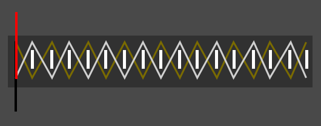

# Electronics

You can find information about building the physical trident [here](physical), the [software](software), and how it was finished [here](finish).

## Adafruit

Through this project I have become a huge fan of [Adafruit](http://adafruit.com).  They create and sell a variety of electronics components with an eye toward making them as accessible as possible to electronics neophytes like me (software development and working with computer hardware is a surprisingly different thing from electronics).  I was able to focus on the software without any concerns for even a single resistor.  Their support was excellent and they clearly care about what they do.  I can't say enough about them!  I'm sure I couldn't have done this without their excellent products.

## Components

* [Pro Trinket 5V](https://www.adafruit.com/products/2000) - Arduino compatible board with plenty of I/O.  So cool.
* [LiIon/LiPoly Backpack](https://www.adafruit.com/products/2124) - this attaches to the Pro Trinket to allow it to run off of a battery.  It handles all the charging issues.  Super easy.
* [500mAh Lithium Ion Polymer Battery](https://www.adafruit.com/products/1578) - This battery probably holds enough charge for two performances but in my experience it's cutting it close.  I'd charge before every performance or consider a larger batter˜.
* 2x [Tactile On/Off Switch](https://www.adafruit.com/products/1092) - One for power (connected to the LiPo Backback) and one for Triton/Ursula mode
* [Pushbutton](https://www.adafruit.com/products/1502) - I used this for the "magic" button.  I'd recommend getting a second one and adding a reset button so you can update the code without having to take out the Trinket.
* [Arcade Button](https://www.adafruit.com/products/471) - I used this for the "attack" button
* [RGB DotStar LEDs](https://www.adafruit.com/products/2240) - these are the LEDs I used for the shaft.  I used 60 of them plus 1 for the mode indicator at the top.  Really, I used 56 of them and had a ring of white LEDs at the top of the shaft (see below).  I adjusted the code for that but didn't include it in the version here.
* [White DotStar LEDs](https://www.adafruit.com/products/2436) - these are the LEDs I used for the tines.  I used 30 of them plus 4 extra at the top of the shaft because I ruined two of the RGB LEDs.
* [LED strip extension cable](https://www.amazon.com/gp/product/B011563YX2/ref=oh_aui_detailpage_o03_s04) - for wiring between the individual LEDs
* [4 Pin JST connectors](https://www.amazon.com/gp/product/B0140KO7K4/ref=oh_aui_detailpage_o08_s00) - I used a pair of these so that I could make the tines detachable from the shaft when I was in development.  It's not necessary but it was helpful a number of times.
* [Micro USB extension cable](https://www.amazon.com/gp/product/B00W6URQPE/ref=oh_aui_detailpage_o03_s03) - allows you to run the USB connection outside of the shaft so you can charge it without having to take it apart.

## Pinouts
Here are the pinouts I used and which match the code in this repository.

## Soldering

You'll need to cut the LED strips and solder the LEDs using the wire listed above.  Yes, this adds up to over 720 solder joints!  If you follow the advice in
[this excellent guide](http://www.ecolocityled.com/category/led_tutorials_rgb_solder) and have the proper soldering iron and other tools you can probably get it done within about 5-6 hours.  I had done very little soldering before this and started with a poor technique so I ended up putting in much more time, and stress, than was necessary.

## LEDs

The LEDs are arranged in "rings" of 4 LEDs going up the shaft starting from the bottom.  I have 15 rings for a total of 60 LEDs on the shaft, plus an additional mode indicator LED that is always on but not bright enough for the audience to see it.  Note that there is nothing about the wiring that makes them rings, just placement.  Electrically, there are all one long strand from the bottom of the shaft all the way up and snaked through the tines.  You'll need three short wire ribbons per ring and then one longer one to reach the beginning of the next ring.  There's no practical way (I thought of anyway) to keep the long ribbon tight against the shaft, but once you cover it with foam it actually provides interesting detail.  Don't sweat it.  But do keep it consistent.  Wire the 60 shaft LEDs and then add one more (if you'd like) for the mode indicator.  All wiring among the shaft LEDs is external to the PVC except a hole I drilled on the bottom where it comes in and a hole at the top where the wire goes internal on its way to the tines.

Once the wire is through the top hole I attached a 4-wire JST connector so that I could easily detach the head from the shaft as desired throughout the building process.  Once the project was complete I did not intend to take the head off again - though I suppose it would help if I ever wanted to ship it somewhere.  The head wiring runs up though the cross and over to one of the side tines.  I drilled a hole on either side of the tine (front and back, not on the sides) so that the wire comes out one hole on the bottom, has 5 of the soft white LEDs running up the "front" (not that there's a front or back), then a long wire that folds around and over the angled side of the point (I carved out a notch for the wire with a Dremel tool so it didn't create a bump on the point) and down the "back" of the tine with another 5 LEDs and into the second hole.  The over to the middle for the same thing, then over to the last tine for the same thing again, though the second hole wasn't necessary as the strip simply ends on the back side of the third tine.

Originally I was applying the LEDs with hot glue.  DON"T DO THIS! If you have to make any repairs you'll have a mess, as the hot glue melts at a far lower temperature than the solder.  Use electrical tape.

## Pressure Sensors

In some ways this was the trickiest part.  I love the idea of it but getting it to work takes some serious finess.  You will undoubtedly have to adjust some of the settings in the software to make this work properly, and you can't really figure out the settings until the trident is fully assembled - which is after you might access the wiring to get more accurate readings.  So trial and error will have to do.  This will be clearer soon.

Here's how it works: the velostat membrane is what you might call a variable resistor.  Like a potentiometer.  Except instead of turning a dial, you squeeze.  The signal crosses from a positive wire on one side of the membrane to a ground wire on the other side.  You read in the positive wire on an analog port on the Trinket.  The more you squeeze, the less resistance.  

  
  
Two different wires, stripped and bent into zig-zag.  Color here is just for differentiation.

To set this up I stripped two wires and bent them into a 'zig-zag' - like the stripe on Charlie Brown's shirt.  The thickness was about 1-1/4-in - I put two of them between two LED rings so that's about as wide as you can go and still have a decent amount of gap between the two.  It should wrap all the way around the shaft so you can grab it from any side.  I used small pieces of electrical tape to attach one wire directly onto the PVC.  I would have liked to have just covered it with the membrane but by the time you put on the membrane, the second wire, and any additional covering you'll undoubtedly have some pretty good pressure on it, in which case you'll always get a high reading.  

  
  
Assembled pressure sensor - wire with foam spacers, membrane, then second wire

To reduce this I decided to put small strips of the foam coating in between the "waves" of the inner wire (see the image).  Then I covered it all with the membrane and then the second wire, placed so that the centers of each "wave" crossed.  I then covered it all with foam.

You'll find that the readings can be inconsistent depending on a number of factors including how tightly wrapped you have things.  I ended up having the primary sensor just control whether or not it was "on" (lit up) or not, a second sensor right next to it to control the first range of intensity, and the third sensor lower down on the shaft so I could grab it when holding the trident with two hands.  I put the first two sensors right next two each other, between two LED rings.  I had the "primary" sensor below the "secondary" sensor (as referred to in the software) but I think I'd do it the other way (primary on top) if I were doing it over.  That way you turn it on/off with the strongest part of your hand.  There are a number of settings in the software that you can adjust to get the input right.

## Buttons

### Tactile On/Off Switch

There are two of these - one for power that connects directly to the Li/Po Backpack (you have to scrape away the printed connection on the PCB) and the other for Triton/Ursula mode.  Both buttons were simply hot-glued into place and covered with foam.  I put the power button out of the way just above the cap all the way on the bottom of the shaft and the mode button just under the bushing at the top.  The mode button needs to be within easy reach when switching it back and forth when giving it to and getting it back from Ursula.

### Arcade "Attack" Button

The attack is used to destroy Ariel's grotto toward the end of Act I.  I put this button just above the tertiary pressure sensor on the shaft.  This way I could use one hand on top to turn the LEDs on and increase the pressure on the secondary sensory and have the other hand squeezing the tertiary sensor, with my thumb ready to press the attack button. I had to drill a hole to accommodate this button.

### "Magic" Pushbutton

This controls "magic" mode, used when turning Ariel into a human just before the finale.  I placed it just above the upper pressure sensors.  I used this button as an anchor so I'd know that I was holding the trident properly with regard to the audience and so that when I grabbed it with my other hand I was in place to press the attack button.  This also required drilling a hole in the shaft.

### Reset Button

I didn't do this but I wish I had.  The Trinket Pro has a tiny button that you have to press in order to upload a new version of the software.  This is fine when you are first connecting things.  It's harder but still possible to access once everything is connected.  It is impossible to reach, of course, when the Trinket is inside the shaft.  Since you probably will need to tweak the pressure sensor settings as one of the last steps, this makes things difficult.  So you might consider adding a reset button that you can wire to the Trinket.  The only danger is that you might hit it during the show, though I'm pretty sure that wouldn't actually cause a problem.  If it does then perhaps there's a way to run it in series with an on/off button (perhaps the power button?) so that it only resets when you want.  Either way, I wish I'd set this up.

## USB Extension

Even more important than the reset button is making it so that you can charge the battery even after the trident is fully assembled.  To facilitate this I connected a short USB extension cable to the Trinket and ran it to the outside of the shaft.  To do so I used the Dremel tool to cut a narrow notch (wide enough for the cable itself) up from the bottom of the shaft pipe, long enough so that the wire would sit comfortably within it with the bottom cap attached.  I covered it with white electrical tape and I doubt anyone in the audience noticed it.

## Wiring

For most of the wiring I used some old Cat5 networking cable I had lying around.  You need wiring that is strong enough to stay attached and carry enough current (which is minimal here).  What it didn't have, though, is much flexibility.  It turned out that getting the battery and Trinket up into the shaft took a bit more jamming than I liked.  Nothing came undone but perhaps if the wire had been more flexible, or perhaps if I had created some soft of springiness to the way it was bent, this would have been easier.  An alternative would have been to create some sort of access panel in the shaft, and I gave that some serious consideration but in the end I was very happy that I didn't compromise the integrity of the shaft in any way.

## Charging

The Li/Po Backpack handles all the charging concerns for you.  It just needs power connected to the USB.  Of course you can plug the USB in to a wall transformer but it means that not only do you need a wall outlet available, you need it to be properly placed so that you can have the trident in a safe position.

Instead I used a phone batter backup - [something like this](https://www.amazon.com/DULLA-M50000-Portable-12000mAh-External/dp/B01DHTV0Q8/ref=sr_1_5).  You can use pretty much any size - the battery I used for the trident was 500mAh, so a backup battery like this can theoretically hold 24 charges for the trident.  Just plug the trident into this instead of the wall, which you can do pretty much anywhere.
