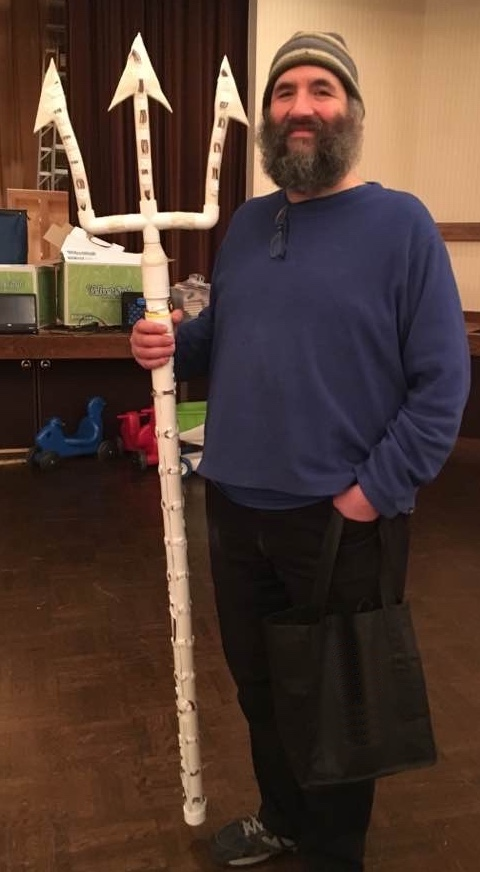

### Decorative Elements

  
  
Pre-finish.  I wish I had taken more pictures to show you.

My general intention was to imply that the trident was made from natural elements without fine craftsmanship.  These are the things I used:

* [Foam covering](https://smile.amazon.com/gp/product/B002JPX68W/ref=oh_aui_detailpage_o09_s00) - I covered everything except for the tines themselves in this foam.  I think it turned out great.  It wasn't smooth, as the components underneath created bulges, etc, but I like the way that looked.  After I applied the foam I lit up the LEDs and marked each spot with a sharpie, then cut it out with an Xacto knife.  One thing I regret about applying the foam is that I didn't fully consider where the seams would end up.  With more foresight I think I'd have had a front and back, at least on the shaft, with seams running up both sides that I could then cover with some ribbon.  I don't think the seams were visible on stage but it would have made for a better finish close-up.  I applied the foam with hot glue.
* [White electrical tape](https://smile.amazon.com/gp/product/B000FP8HSM/ref=oh_aui_detailpage_o04_s02) - I used copious amounts of tape.  All the LEDs were held down by tape.  The tines were completely covered with tape.  I used an entire roll of 66 feet!
* [Liquid Leaf Paint](http://www.michaels.com/liquid-leaf-leafing-paint-florentine-gold/10014831.html) - After wrapping with tape I painted the tines with gold leaf.  A little goes a long way so one small bottle is far more than enough.  The paint I used was a bit darker than I would have liked but it still worked well.
* various ribbon - for finishing edges and adding some detail.
