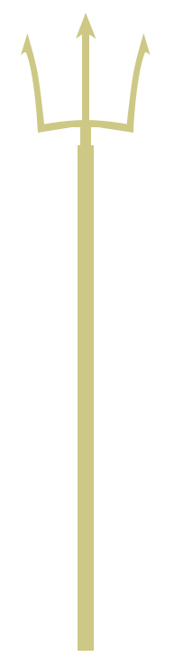
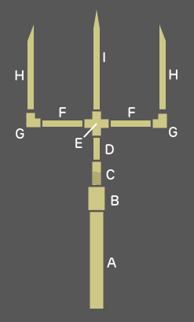

# Building the Trident

The underlying structure for the trident is all PVC.  I used 1-1/2-in pipe for the shaft and 3/4-in pipe for the tines.  The points were made with [Original Sculpey](https://www.sculpey.com/product/original-sculpey/).  I needed about 1/2 a pound, including bulking up around part F to make it a consistent width between the elbows (G) and the center cross (E).

## Parts

(A) Shaft - 1-1/2-in PVC cut to 5'6"

[(B) 1-1/2-in x 3/4-in bushing](https://www.lowes.com/pd/LASCO-1-1-2-in-Dia-x-3-4-in-Dia-PVC-Sch-40-Bushing/3371478)

[(C) Threaded adapter](https://www.lowes.com/pd/LASCO-3-4-in-Dia-PVC-Sch-40-Adapter/1067457)

(D) 2" 3/4-in PVC to couple the threaded adapter (C) to the cross tee (E)

[(E) Cross Tee](https://www.lowes.com/pd/LASCO-3-4-in-Dia-90-Degree-PVC-Sch-40-Cross-Tee/3371630)

(F) 2x 4" 3/4-in PVC horizontal connections to hold tines

[(G) 2x  Elbow](https://www.lowes.com/pd/LASCO-3-4-in-Dia-90-Degree-PVC-Sch-40-Elbow/3339830)

(H) 2x side tines - 3/4-in PVC cut on an angle to 10" on the long side, 8" on the short side

(I) center tine - 3/4-in PVC cut with angles on both sides of one end to a point, 12" in the center, 9-1/2" on the sides

[(not shown) Cap](https://www.lowes.com/pd/LASCO-1-1-2-in-Dia-PVC-Sch-40-Cap/3371576)

<h2 class='new-section'>Points</h2>

As I mentioned above, the points are made with [Sculpey](https://www.sculpey.com/product/original-sculpey/).  They turned out better and stronger than I imagined.  Note that I cut the PVC tines with points - not to be the final points but to provide support to the Sculpey points.  I do think the extra support helps but the one on the center tine will get in the way unless you use a heat gun to warp them toward each other (see more about that below).  Otherwise just eliminate them or extend the clay points beyond the PVC.

I hadn't worked much with Sculpey before.  If I were to make another trident I'd have worked further to get the points smoother than I did.  I was able to shape them after they were baked using sandpaper but they could have been much cleaner.  That said, as a stage prop that level of detail wasn't necessary.

I shaped and baked the clay within the PVC (i.e. I put the PVC in the oven with the clay).  This allowed for a very smooth transition between the PVC and clay, plus a strong connection.  This works well for the tines but not for the horizontal cross-bar (see notes below).

Note that the PVC can sag a little when it's baked.  Just something to keep an eye out for.

Maybe someday someone will submit some 3D printer files that could be used to just create the points such that they'd fit right into the PVC.  Let me know if you do this please!

## Curved Tines

You'll notice that the outer tines and the horizontal cross-bar are curved. This isn't absolutely necessary but I think it's a wonderful detail.  I used a heat gun like [this](https://www.lowes.com/pd/Wagner-HT1000-Heat-Gun/3067569) to heat up the PVC to allow me to bend it.  Some notes:

* heat it up slowly and evenly - you don't want to burn the PVC
* it's important that the curve on the outer tines matches.  I created a pretty minimal "jig" to help define the shape as I bent the heated tines.
* bent PVC has some level of "stress" in it, such that if it's reheated it will want to straighten out.  So for the tines I would add the points and bake before trying to bend the tines.  I did it the other way and then had to re-bend them.
* I also had Sculpey around the horizontal cross-bar, specifically parts (F) so that it was one uniform thickness across (the F parts fit into the (G) elbows).  This creates a "chicken-egg" issue.  I bent the parts before I added the clay - of course - there's no point in adding the clay when the pieces are still straight.  However, as I mentioned above, when I baked the Sculpey for these pieces the PVC wanted to straighten out a bit.  It all worked out fine but I didn't quite have the curve I wanted.  Perhaps I could have put some sort of shaped wood inside to help it maintain its curve, but I'd have been concerned about being able to take it out.

Note that I also formed Sculpey around the threaded adapter (C) to make a smoother transition from the 1-1/2-in bushing and the cross tee (E).  No concerns about bending here.

## Finish

The last part is the cap, not shown in the diagram but there's a link provided to the part.  There are still a few holes to drill but I'll cover that on the [electronics](electronics) page.

## Finalizing

Once everything was complete, including the finish, I used small screws, pre-drilled, to hold everything together.  
